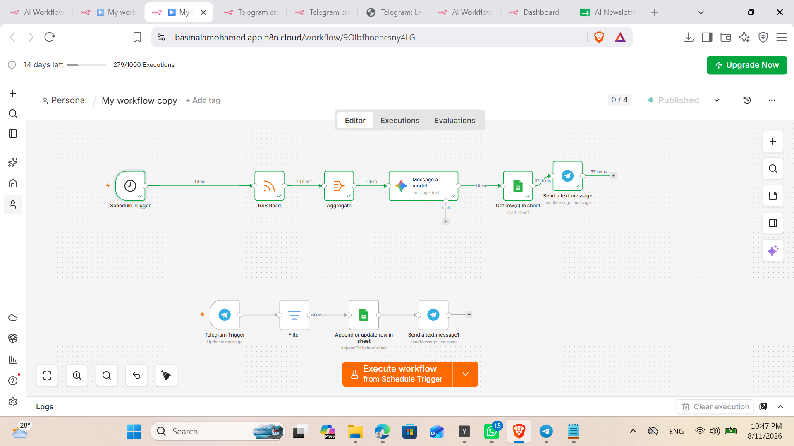

# n8n-ai-telegram-newsletter
An automated Telegram bot that collects subscribers, fetches daily RSS tech news, summarizes them using AI, and broadcasts daily newsletters via n8n and Google Sheets.

# 🤖 AI-Powered Telegram Newsletter Automation Bot

An end-to-end automated workflow built with **n8n**, **Telegram API**, **Google Sheets API**, and **LLMs (Large Language Models)**. The system handles user subscriptions, stores data, aggregates daily tech news via RSS feeds, generates concise AI summaries, and broadcasts them automatically to subscribers.

---

## 📌 Workflow Architecture

---

## ✨ Features
* **Automated User Onboarding:** Listens for the `/start` command via Telegram Webhook, filters inputs, and stores subscriber details in Google Sheets.
* **Instant Welcome Response:** Sends a customized confirmation message back to newly registered users.
* **Daily Scheduled Trigger:** Runs automatically at a pre-set time every day.
* **Content Aggregation:** Fetches the latest articles from tech RSS feeds.
* **AI Summarization:** Uses an LLM to digest multiple news items into a structured, user-friendly daily newsletter summary.
* **Bulk Broadcast:** Reads all subscriber Chat IDs from Google Sheets and dispatches the newsletter seamlessly.

---

## 🛠️ Tech Stack & Tools
* **Automation Platform:** n8n
* **Messaging Platform:** Telegram Bot API
* **Database / Storage:** Google Sheets API
* **AI Model:** OpenAI / Gemini LLM
* **Data Aggregation:** RSS Feed Parsing

---

## 🚀 How to Import & Setup

1. **Clone or Download:** Download the `workflow.json` file from this repository.
2. **Import to n8n:**
   * Open your n8n instance.
   * Create a new Workflow.
   * Click **Import from File** and select `workflow.json`.
3. **Configure Credentials:**
   * Add your **Telegram Bot Token** in the Telegram trigger and message nodes.
   * Connect your **Google Sheets Account** and select your targeted spreadsheet.
   * Add your **LLM API Credentials** (OpenAI/Gemini).
4. **Activate:** Toggle the workflow status to **Active / Published**.

5. ## To use the BOT please visit this link : t.me/DraCula01010_bot.
